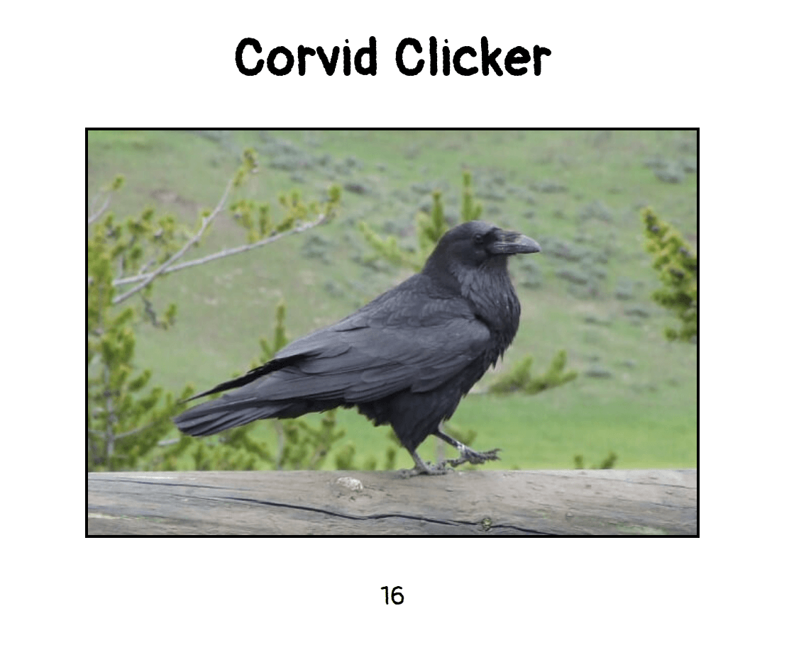

# Corvid-Clicker

## Requirements

- The page should display a picture of a corvid and a number of clicks.
- The number of clicks should increment when the corvid picture is clicked.
- Implementation should use HTML, CSS, and vanilla Javascript.

## Screenshot

## License

This project is licensed under the [GPL v3](LICENSE).
